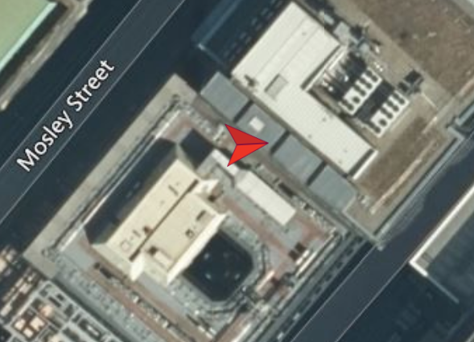

.. _installing-qgroundcontrol-and-running-it-with-gazebo--px4-firmware-and-creating-a-plan:

Installing QgroundControl and Running it with Gazebo & PX4 Firmware and creating a plan
=======================================================================================

Installing QgroundControl
-------------------------

Through QgroundControl, you can plan the desired path for your drone
visually and run your simulation with Gazebo and PX4 Firmware.

1) go to `http://qgroundcontrol.com/ <http://qgroundcontrol.com/>`__ and
   click on download icon.
2) Write the following commands mentioned on the above website for Linux
   Ubuntu in Terminal, one-by-one and press Enter.

.. code:: sh

   sudo usermod -a -G dialout $USER
   sudo apt-get remove modemmanager -y
   sudo apt install gstreamer1.0-plugins-bad gstreamer1.0-libav gstreamer1.0-gl -y

3) Click on the hyperlink of “1. Download QgroundControl.AppImage.” on
   the website to download the file.
4) Now, open Downloads file of your computer and check file
   “QgroundControl.AppImage” to be there. Right click on the environment
   of Downloads and select “Open in Terminal”.
5) Write the following commands mentioned on the above website in
   Terminal and press Enter.

.. code:: sh

   chmod +x ./QGroundControl.AppImage

6) Now, you have QGroundControl installed on your computer. You can open
   it by double clicking on file QgroundControl.AppImage in Downloads.

(This section is inferred from 2:40 to 4:15 of the clip on:
`https://www.youtube.com/watch?v=-zEddRFbMvQ <https://www.youtube.com/watch?v=-zEddRFbMvQ>`__)

Running QGroundControl with Gazebo and PX4 Firmware to create a plan based on waypoints
---------------------------------------------------------------------------------------

1) Open QGoruondControl by double clicking on file
   QgroundControl.AppImage in Downloads.
2) Write cd Firmware in the terminal. Write the following codes in
   terminal to make the quadrotor at its home location and open Gazebo
   with PX4. (The following location is in Manchester city)

.. code:: sh

   export PX4_HOME_LAT=53.4800000000000000
   export PX4_HOME_LON=-2.2400000000000000
   export PX4_HOME_ALT=0
   make px4_sitl gazebo

3) Now you should be able to see your quadrotor as a red arrow in
   QGroundControl and also in Gazebo. If you click on the quadrotor in
   Gazebo, you can see the quadrotor in a white cube to be more obvious.
   |Figure 1: Arrow of the quadrotor in QGroundControl|

